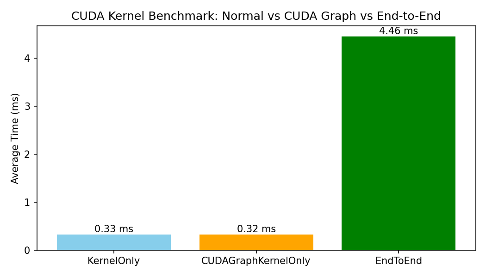

# CUDA Vector Add with CUDA Graphs & Nsight Profiling

High-performance CUDA project demonstrating:
- CUDA Streams & async memory transfers
- CUDA Graph capture & replay
- Kernel benchmarking with CUDA events
- Nsight Systems & Nsight Compute profiling

## Features
- Pinned host memory
- Reduced kernel launch overhead via CUDA Graphs
- Reproducible benchmarks
- CMake-based build system

## Build
```bash
mkdir build && cd build
cmake ..
make
python3 plot_results.py
```

or
```bash
# 1. Compile CUDA code
nvcc vector_add_graph_events.cu -o vector_add_graph

# 2. Run benchmark
./vector_add_graph

# 3. Plot results
python3 plot_results.py


# CUDA Vector Add Benchmark

This repository benchmarks **normal kernel**, **CUDA Graph kernel-only**, and **end-to-end including memory copies**.

| Benchmark                  | Avg Time (ms) | Speedup (vs KernelOnly) |
|----------------------------|---------------|------------------------|
| Kernel-only                | 0.33          | 1x                     |
| CUDA Graph kernel-only      | 0.30          | 1.10x                  |
| End-to-end (with memcpy)    | 4.44          | 0.07x                  |
```



> CUDA Graph provides slight speedup for kernel-only execution. End-to-end timing is dominated by Host ↔ Device memory copies.


## Run Benchmark

You can compile, run, and plot the CUDA vector addition benchmark **with a single command**:

```bash
chmod +x run_benchmark.sh
./run_benchmark.sh
```
Example Output
```bash
A = [0, 1, 2, 3, 4, 5, 6, 7, 8, 9, ...]
B = [0, 2, 4, 6, 8, 10, 12, 14, 16, 18, ...]
C = [0, 3, 6, 9, 12, 15, 18, 21, 24, 27, ...]
Kernel-only avg time: 0.33 ms
CUDA Graph kernel-only avg time: 0.30 ms
End-to-end avg time: 4.44 ms
```